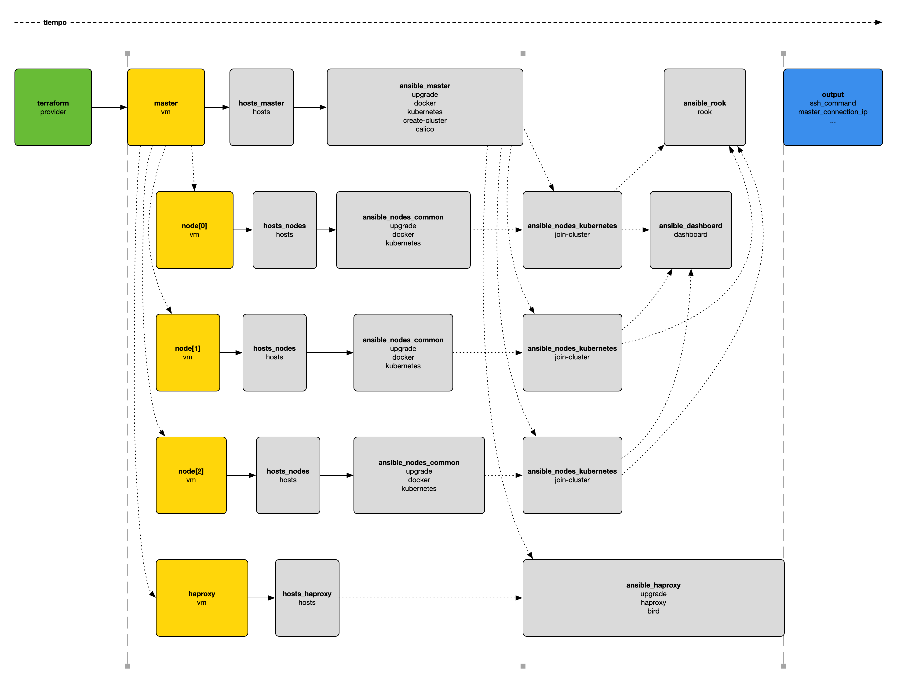

# kubernetes-opennebula

Cluster [Kubernetes](https://kubernetes.io) desplegado con [Terraform](https://www.terraform.io)
y [Ansible](https://www.ansible.com) en [OpenNebula](https://opennebula.io).

## Puesta en marcha

1. Crear el fichero `.env` a partir de `env-example` y configurar las variables.
2. Crear el fichero `terraform/variables.tf` a partir de `terraform/variables.tf.example` y configurar las variables.
3. Crear el fichero `ansible/versiones.yml` a partir de `ansible/versiones.yml.example`.
4. Construir el contenedor donde se ejecuta Terraform.

    ```shell
    make build
    ```
5. Crear la clave privada SSH para Ansible e inicializar Terraform.

    ```shell
    make init
    ```

6. Desplegar el cluster en OpenNebula.

    ```shell
    make apply
    ```

7. Conectarse al nodo maestro del cluster.

    ```shell
    make ssh
    ```

## Acceso al Dashboard

Obtener el token temporal de acceso:

```shell
make dashboard-token
```

## Timeline de creación del cluster



## Recursos necesarios

| Nodo    | CPUs | Memoria (GB) | Disco (GB) |
|---------|:----:|:------------:|:----------:|
| master  |  2   |      4       |     16     |
| node-0  |  1   |      3       |     24     |
| node-1  |  1   |      3       |     24     |
| node-2  |  1   |      3       |     24     |
| haproxy |  1   |      1       |     8      |
| Total   |  6   |      14      |     96     |

## Referencias

- [Documentación del proveedor de OpenNebula](https://registry.terraform.io/providers/OpenNebula/opennebula/latest/docs)
- [Cluster de Kubernetes con Vagrant](https://github.com/ijaureguialzo/vagrant-kubernetes)
- [Install and Set Up kubectl on Linux](https://kubernetes.io/docs/tasks/tools/install-kubectl-linux/)
- [alpine-kubectl](https://github.com/wayarmy/alpine-kubectl/blob/master/1.8.0/Dockerfile)
- [How to detect 386, amd64, arm, or arm64 OS architecture via shell/bash](https://stackoverflow.com/questions/48678152/how-to-detect-386-amd64-arm-or-arm64-os-architecture-via-shell-bash)
- [print terraform output from list of list to a list of strings](https://stackoverflow.com/questions/71748316/print-terraform-output-from-list-of-list-to-a-list-of-strings)
- [How to Install Kubernetes on Ubuntu 22.04 / Ubuntu 20.04](https://www.itzgeek.com/how-tos/linux/ubuntu-how-tos/install-kubernetes-on-ubuntu-22-04.html)
- [How to Install Kubernetes Cluster on Ubuntu 22.04](https://www.linuxtechi.com/install-kubernetes-on-ubuntu-22-04/)
- [Ubuntu 22.04 and Kubernetes recently Broke Compatibility with Each Other (and how to work around it)](https://www.learnlinux.tv/ubuntu-22-04-and-kubernetes-recently-broke-compatibility-with-each-other-and-how-to-work-around-it/)
- [Ansible playbook to upgrade Ubuntu/Debian servers and reboot if needed](https://www.jeffgeerling.com/blog/2022/ansible-playbook-upgrade-ubuntudebian-servers-and-reboot-if-needed)
- [Ansible Register](https://www.educba.com/ansible-register/)
- [How to Use Environment Variables on Terraform](https://medium.com/codex/how-to-use-environment-variables-on-terraform-f2ab6f95f82d)
- [How can I manage keyring files in trusted.gpg.d with ansible playbook since apt-key is deprecated?](https://stackoverflow.com/a/73805885)
- [Passing additional variables from command line to make](https://stackoverflow.com/questions/2826029/passing-additional-variables-from-command-line-to-make)
- [JSON Output Format](https://developer.hashicorp.com/terraform/internals/json-format)
- [How to Parse JSON Files on the Linux Command Line with jq](https://www.howtogeek.com/529219/how-to-parse-json-files-on-the-linux-command-line-with-jq/)
- [SSH Tunnel within docker container](https://stackoverflow.com/questions/60116630/ssh-tunnel-within-docker-container)
- [How can I make "Press any key to continue"](https://unix.stackexchange.com/questions/293940/how-can-i-make-press-any-key-to-continue)

### HAProxy

- [Debian/Ubuntu HAProxy packages](https://haproxy.debian.net)
- [Install Calico with Kubernetes API datastore, 50 nodes or less](https://docs.tigera.io/calico/3.25/getting-started/kubernetes/self-managed-onprem/onpremises#install-calico-with-kubernetes-api-datastore-50-nodes-or-less)
- [Run the HAProxy Kubernetes Ingress Controller Outside of Your Kubernetes Cluster](https://www.haproxy.com/blog/run-the-haproxy-kubernetes-ingress-controller-outside-of-your-kubernetes-cluster/)
- [Enable external mode for an on-premises Kubernetes installation](https://www.haproxy.com/documentation/kubernetes/latest/installation/community/external-mode/external-mode-on-premises/)
- [Install calicoctl](https://docs.tigera.io/calico/3.25/operations/calicoctl/install)
- [Route traffic to an example app](https://www.haproxy.com/documentation/kubernetes/latest/usage/ingress/)
- [ingress-controller-external-example](https://github.com/haproxytechblog/ingress-controller-external-example/blob/master/app.yaml)
- [The Ultimate Guide To Using Calico, Flannel, Weave and Cilium](https://platform9.com/blog/the-ultimate-guide-to-using-calico-flannel-weave-and-cilium/)
- [HAProxy Kubernetes Ingress Controller](https://github.com/haproxytech/kubernetes-ingress)
- [Configure a TLS certificate for all services](https://www.haproxy.com/documentation/kubernetes-ingress/ingress-tutorials/terminate-ssl/#configure-a-tls-certificate-for-all-services)

### Rook

- [Rook](https://rook.io)
- [Getting Started](https://rook.io/docs/rook/v1.10/Getting-Started/intro/)
- [Quickstart](https://rook.io/docs/rook/v1.10/Getting-Started/quickstart/)
- [Host Storage Cluster](https://rook.io/docs/rook/v1.10/CRDs/Cluster/host-cluster/)
- [Troubleshooting](https://rook.io/docs/rook/v1.10/Troubleshooting/ceph-toolbox/)
- [Block Storage (RBD)](https://rook.io/docs/rook/v1.10/Storage-Configuration/Block-Storage-RBD/block-storage/)
- [Shared Filesystem (CephFS)](https://rook.io/docs/rook/v1.10/Storage-Configuration/Shared-Filesystem-CephFS/filesystem-storage/)
- [Rook OSD after node failure](https://stackoverflow.com/a/59885815)

### Dashboard

- [Kubernetes Dashboard](https://github.com/kubernetes/dashboard)
- [Installing Helm](https://helm.sh/docs/intro/install/)
- [Accessing Dashboard](https://github.com/kubernetes/dashboard/blob/master/docs/user/accessing-dashboard/README.md)
- [Kubernetes Dashboard Token Expired in One hour. How to create token for long time](https://stackoverflow.com/questions/73416660/kubernetes-dashboard-token-expired-in-one-hour-how-to-create-token-for-long-tim)
- [Adjusting the timeout of the Kubernetes Dashboard](https://blinkeye.github.io/post/public/2019-05-30-kubernetes-dashboard/)
- [How can I make the automatic timed logout longer?](https://stackoverflow.com/questions/58012223/how-can-i-make-the-automatic-timed-logout-longer)

### Portainer

- [Install Portainer CE on your Kubernetes environment](https://docs.portainer.io/start/install-ce/server/kubernetes/baremetal)
- [How to prevent kubectl interactive shell from being closed after few minutes (increase timeout) / or terminal from dying?](https://stackoverflow.com/a/73907885)

### Headlamp

- [In-cluster](https://headlamp.dev/docs/latest/installation/in-cluster/)
- [Create a Service Account token](https://headlamp.dev/docs/latest/installation/#create-a-service-account-token)

### Extras

- [Automatically generated secrets for Kubernetes](https://github.com/mittwald/kubernetes-secret-generator)

### Monitorización

- [A Hands-On Guide to Kubernetes Monitoring Using Prometheus & Grafana](https://medium.com/@muppedaanvesh/a-hands-on-guide-to-kubernetes-monitoring-using-prometheus-grafana-%EF%B8%8F-b0e00b1ae039)
- [How to collect and query Kubernetes logs with Grafana Loki, Grafana, and Grafana Agent](https://grafana.com/blog/2023/04/12/how-to-collect-and-query-kubernetes-logs-with-grafana-loki-grafana-and-grafana-agent/)
- [Install the monolithic Helm chart](https://grafana.com/docs/loki/latest/setup/install/helm/install-monolithic/#single-replica)
- [Deploy Grafana Alloy on Kubernetes](https://grafana.com/docs/alloy/latest/set-up/install/kubernetes/)
- [Collect Kubernetes logs and forward them to Loki](https://grafana.com/docs/alloy/latest/collect/logs-in-kubernetes/)
- [failed to create fsnotify watcher: too many open files](https://serverfault.com/a/1137212)
- [How to run a script on boot up in Debian 11](https://www.fosslinux.com/50812/run-script-boot-up-debian.htm)
